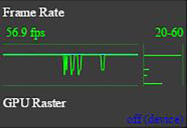
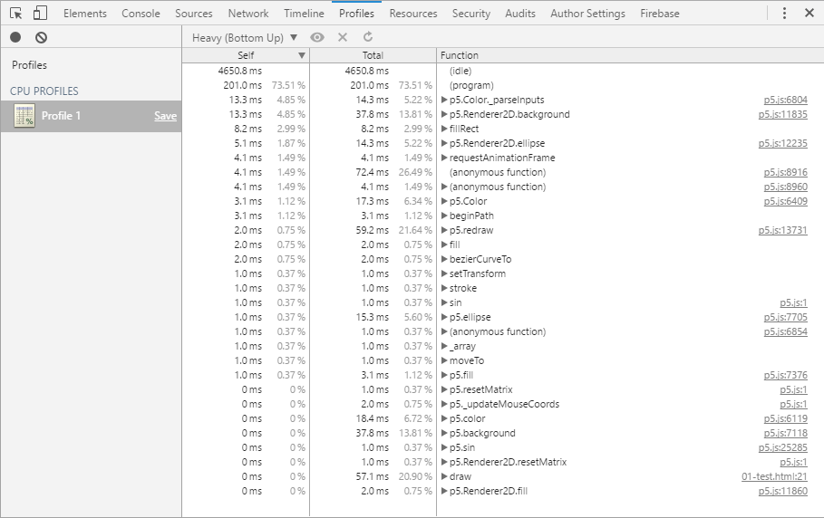

# Optimizing p5.js Code for Performance

Note: this is a work-in-progress wiki for [p5.js](https://github.com/processing/p5.js) on performance.

**Add some intro here**

<!-- TOC depthFrom:2 depthTo:6 withLinks:1 updateOnSave:1 orderedList:0 -->

- [A Word of Caution](#a-word-of-caution)
- [Profiling](#profiling)
	- [Frames Per Second (FPS)](#frames-per-second-fps)
	- [Manual Profiling](#manual-profiling)
	- [Automated Profiling](#automated-profiling)
- [General p5 Tips](#general-p5-tips)
	- [Disable the Friendly Error System](#disable-the-friendly-error-system)
	- [Switch Platforms](#switch-platforms)
	- [Use Native JS in Bottlenecks](#use-native-js-in-bottlenecks)

<!-- /TOC -->

 _

## A Word of Caution

When it comes to performance, it's tempting to try to squeeze out as much speed as you can right from the get-go. Writing code is a balancing act between trying to write something that is easy to read & maintain and something that gets the job done. Performance optimizations often come with some sacrifices, so in general, you should only worry about optimizing when you know there is a speed problem.

## Profiling

The first step in speeding up code is usually to [profile](https://en.wikipedia.org/wiki/Profiling_(computer_programming)) it - to try to get an idea of how long each piece of the code takes to run.

### Frames Per Second (FPS)

One general measure of your program's speed is the number of frames per second (FPS) is can run. You generally want to aim for a consistent 30 - 60 FPS if your code involves interaction or animation.

You can see your current FPS easily in one of two ways.

In p5, you can call `frameRate()` without any parameters to get the current FPS. Then you can dump that to the console or draw it to the screen:

```javascript
// Draw FPS (rounded to 2 decimal places) at the bottom left of the screen
var fps = frameRate();
fill(255);
stroke(0);
text("FPS: " + fps.toFixed(2), 10, height - 10);
```

With Chrome or the p5 editor, you can open up the developer tools and turn on "Show FPS meter" (**describe how to do this, use this [link](https://developers.google.com/web/tools/chrome-devtools/settings?hl=en#drawer-tabs)**). You'll then see a gray overlay in the browser with an FPS graph. This is nice because it allows you to see how FPS changes over time:



### Manual Profiling

To find out how long a piece of code takes to run, you want to know the what time it is when the code starts running and what time it is right after the code ends. In p5, you can get the current time in milliseconds using [`millis()`](http://p5js.org/reference/#/p5/millis). (Under the hood, this function just returns the result of a native JS method: [`performance.now()`](https://developer.mozilla.org/en-US/docs/Web/API/Performance/now).)

To time a particular piece of code using `millis()`:

```javascript
var start = millis();

// Do the stuff that you want to time
random(0, 100);

var end = millis();
var elapsed = end - start;
console.log("This took: " + elapsed + "ms.")
```

**TODO: explain why you might want to run something multiple times when timing**

### Automated Profiling

Again, developer tools in Chrome and the p5 editor to the rescue.

With both of these tools, it will make your life easier if you use non-minified code (i.e. use "p5.js" over "p5.min.js").

**TODO:** [Timeline panel](https://developers.google.com/web/tools/chrome-devtools/profile/evaluate-performance/timeline-tool#profile-js)

**TODO:** [CPU profiler](https://developers.google.com/web/tools/chrome-devtools/profile/rendering-tools/js-execution?hl=en)



## General p5 Tips

### Disable the Friendly Error System

When you use the non-minified p5.js file (as opposed to p5.min.js), there is a friendly error system that will warn you when you try to override a p5 method, e.g. if you try to do `random = 5;` or `max = 3;`. This error checking system can significantly slow down your code (up to ~10x in some cases). (**Link to test**)

If you are running p5.js version 0.5.3 or greater, you can disable this with one line of code at the top of your sketch:

```javascript
p5.disableFriendlyErrors = true;

function setup() {
  // Do setup stuff
}

function draw() {
  // Do drawing stuff
}
```

If you are running p5.js v0.5.2 or lower, you can disable it in one of two ways: switch over to using `p5.min.js` or use p5 in instance mode (**link to tutorial**).

### Switch Platforms

If possible, you can try switching platforms. As of p5.js v0.5.2 and p5 editor v0.6.0, Chrome & Firefox outperform the p5 editor.

**Add evidence**

### Use Native JS in Bottlenecks

If you know where your performance bottleneck is in your code, then you can speed up the bottleneck by using native JS methods over p5 methods.

Many of the p5 methods come with an overhead. For example: `sin(...)` needs to check whether p5 is in degree mode or radian mode before it can calculate the sin; `random(...)` needs to check whether you have passed in a max and/or min before calculating a random value. In both of these cases, you can just use `Math.random(...)` or `Math.sin(...)`.

The speed boost you will get depends on the particular context: **Add evidence from test code**

Note: many of the p5 math functions were sped up in p5.js v0.5.3, so your gains may vary.
