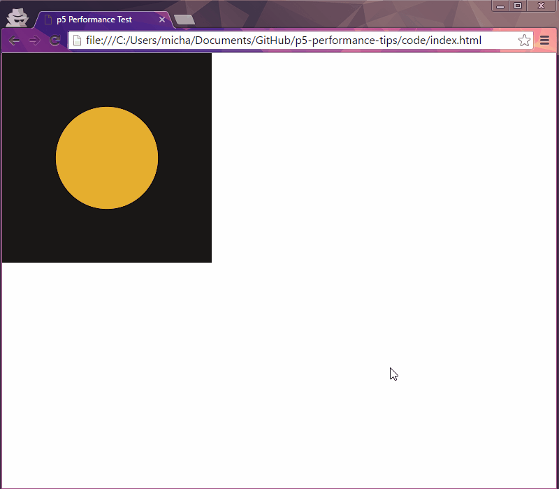
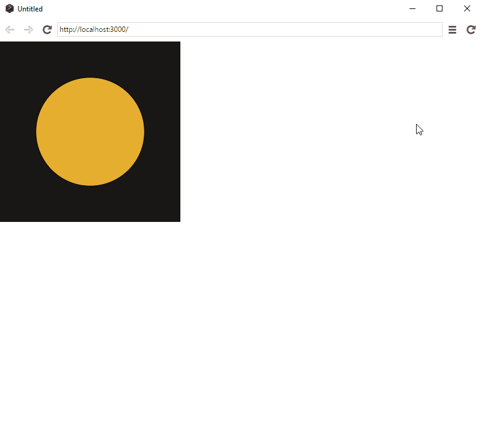
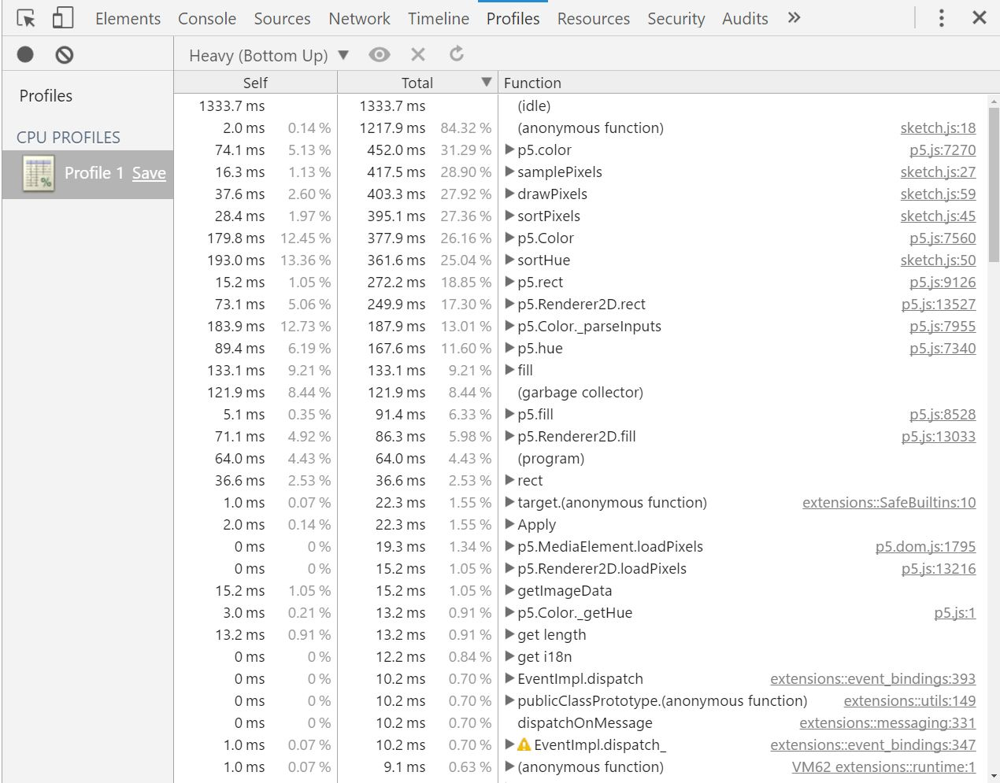
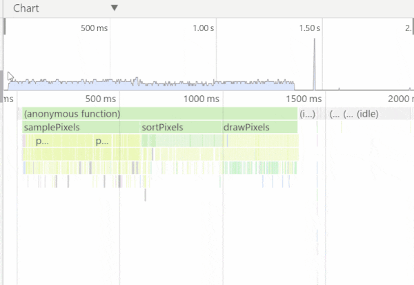

# Optimizing p5.js Code for Performance

Note: this is a work-in-progress wiki for [p5.js](https://github.com/processing/p5.js) on performance.

**TODO: Add some intro here**

<!-- TOC depthFrom:2 depthTo:6 withLinks:1 updateOnSave:1 orderedList:1 -->

1. [Words of Caution!](#words-of-caution)
2. [Identifying Slow Code: Profiling](#identifying-slow-code-profiling)
	1. [Frames Per Second (FPS)](#frames-per-second-fps)
	2. [Manual Profiling](#manual-profiling)
	3. [Automated Profiling](#automated-profiling)
3. [p5 Performance Tips](#p5-performance-tips)
	1. [Disable the Friendly Error System](#disable-the-friendly-error-system)
	2. [Switch Platforms](#switch-platforms)
	3. [Use Native JS in Bottlenecks](#use-native-js-in-bottlenecks)
	4. [Image Processing](#image-processing)
	5. [Caching](#caching)
	6. [Math Shortcuts](#math-shortcuts)

<!-- /TOC -->

## Words of Caution!

When it comes to performance, it's tempting to try to squeeze out as much speed as you can right from the get-go. Writing code is a balancing act between trying to write something that is easy to read & maintain and something that gets the job done. Performance optimizations often come with some sacrifices, so in general, you should only worry about optimizing when you know there is a speed problem.

Along with that, it's important to keep in mind a general mantra of "optimize the algorithm, not the code." Sometimes, you will get nice gains from micro-optimizing a line of code or two. But generally speaking, the big gains you get tend to come from changing your approach. E.g. if you have code that loops through every single pixel in an image, you will certainly speed up your code if you decide that you can instead just look through every other pixel.

## Identifying Slow Code: Profiling

The first step in speeding up code is usually to [profile](https://en.wikipedia.org/wiki/Profiling_%28computer_programming%29) it - to try to get an idea of how long each piece of the code takes to run.

### Frames Per Second (FPS)

One general measure of your program's speed is the number of frames per second (FPS) is can run. You generally want to aim for a consistent 30 - 60 FPS if your code involves interaction or animation.

You can see your current FPS easily in one of two ways.

In p5, you can call [`frameRate()`](http://p5js.org/reference/#/p5/frameRate) without any parameters to get the current FPS. Then you can dump that to the console or draw it to the screen:

```javascript
// Draw FPS (rounded to 2 decimal places) at the bottom left of the screen
var fps = frameRate();
fill(255);
stroke(0);
text("FPS: " + fps.toFixed(2), 10, height - 10);
```

With Chrome or the p5 editor, you can open up the developer tools and turn on the "Show FPS meter" options to get a graph of FPS. This is nice because it allows you to see how the FPS changes over time.

In Chrome, open the developer tools (Windows hotkey: `Ctrl + Shift + I` or `F12`, Mac hotkey:  `Cmd + Opt + I`) and then follow these instructions:



In the p5 Editor:



### Manual Profiling

To find out how long a piece of code takes to run, you want to know the what time it is when the code starts running and what time it is right after the code ends. In p5, you can get the current time in milliseconds using [`millis()`](http://p5js.org/reference/#/p5/millis). (Under the hood, this function just returns the result of a native JS method: [`performance.now()`](https://developer.mozilla.org/en-US/docs/Web/API/Performance/now).)

To time a particular piece of code using `millis()`:

```javascript
var start = millis();

// Do the stuff that you want to time
random(0, 100);

var end = millis();
var elapsed = end - start;
console.log("This took: " + elapsed + "ms.")
```

Usually, you will want to run the code you are trying to profile many times and then find the average time that it took to run. See any of the performance tests in [code/](code/) for examples.

Note: `console.log()` and `println()` will definitely slow down your code, so be sure to remove them from the final version of your project!

### Automated Profiling

Again, the developer tools in Chrome and the p5 editor come to the rescue with some automated tools. With the [CPU profiler](https://developers.google.com/web/tools/chrome-devtools/profile/rendering-tools/js-execution), you can see how much time is spent in each function within your code _without_ adding any manual timing code. When you are dealing with a complicated project and you are not sure where to start optimizing, this is a helpful starting point.

When you want to profile your code, open the developer tools (hamburger icon in the p5 editor). Go to the "Profiles" tab, select "Collect JavaScript CPU Profile" and hit start. This will start timing your code. When you've recorded a large  enough sample, stop the recording and take a look at the results:



It's helpful to look at the CPU profiler results for some real code. The recording for this section is a p5 sketch that gets an image from the webcam, sorts the pixels by hue and then draws them to the screen (see [code/cpu-profiler-demo](code/cpu-profiler-demo/)). There are  four main functions:

-   `samplePixels` - gets a set of pixels from the camera
-   `sortPixels` - sorts the sampled pixels
-   `sortHue` - compares the hue of two colors in order to decide how they should be ordered
-   `drawPixels` - draw the pixels to the screen as colored rectangles

The default view of the recording is a table of functions with their associated timing. It gives you the "self" and "total" times for all the functions in your code. Self time is the amount of time spent on the statements in a function _excluding_ calls to other functions. Total time is the amount of time that it took to run that function _and_ any functions that it calls.

From the total times, we can see that roughly equal amounts of time were spent in `samplePixels`, `drawPixels` and `sortPixels`, so any of them are candidates for trying optimizations. Here, the easiest optimization with the biggest gains would simply be to reduce the number of pixels sampled from the camera frame. That will speed up all three functions.

If you switch the view of the recording from "Heavy (Bottom Up)" to "Chart," you can get a better sense of the breakdown and interactively explore the recording:



Given that the CPU profiler is simply going to show you a table that has function names, it is important for the functions in your code to actually have names. So you should:

-   Use "p5.js" over "p5.min.js", so that p5 functions have non-minified names.
-   Avoid using [anonymous functions](https://en.wikibooks.org/wiki/JavaScript/Anonymous_functions) in your code.

See the [CPU profiler documentation](https://developers.google.com/web/tools/chrome-devtools/profile/rendering-tools/js-execution) for more details.

## p5 Performance Tips

### Disable the Friendly Error System

When you use the non-minified p5.js file (as opposed to p5.min.js), there is a friendly error system that will warn you when you try to override a p5 method, e.g. if you try to do `random = 5;` or `max = 3;`. This error checking system can significantly slow down your code (up to ~10x in some cases). See the [friendly error performance test](code/friendly-error-system/).

If you are running p5.js version 0.5.3 or greater, you can disable this with one line of code at the top of your sketch:

```javascript
p5.disableFriendlyErrors = true;

function setup() {
  // Do setup stuff
}

function draw() {
  // Do drawing stuff
}
```

If you are running p5.js v0.5.2 or lower, you can disable it in one of two ways: switch over to using `p5.min.js` or use p5 in [instance mode](https://github.com/processing/p5.js/wiki/p5.js-overview#instantiation--namespace).

### Switch Platforms

If possible, you can try switching platforms. As of p5.js v0.5.2 and p5 editor v0.6.0:

-   Chrome outperforms the p5 editor.
-   Chrome outperforms Firefox, IE & Edge.
-   Firefox outperforms IE & Edge.

These are generalizations that depend on the specific code you are trying to run and what version of the platform you are using. See the [particle system performance test](code/platforms-test/) for a real example.

### Use Native JS in Bottlenecks

If you know where your performance bottleneck is in your code, then you can speed up the bottleneck by using native JS methods over p5 methods.

Many of the p5 methods come with an overhead. For example: `sin(...)` needs to check whether p5 is in degree mode or radian mode before it can calculate the sin; `random(...)` needs to check whether you have passed in a max and/or min before calculating a random value. In both of these cases, you can just use `Math.random(...)` or `Math.sin(...)`.

The speed boost you will get depends on the specific p5 methods you are using. In v0.5.3, many methods have been optimized (e.g. `abs`, `sqrt`, `log`), but you can still see a performance boost for using `Math.random`, `Math.sin`, `Math.min` over their p5 counterparts. This is especially true for v0.6.0 of the p5 editor. See the [native vs p5 performance test](code/native-vs-p5/):

    Chrome, running methods 10000000x times:

    	p5.random took:     	283.88ms
    	Math.random took: 		190.01ms

    	p5.sin took:            481.14ms
    	Math.sin took:          338.33ms

    	p5.min took:        	781.41ms
    	Math.min took:    		538.15ms

    p5 Editor, running methods 10000000x times:

    	p5.random took:     	2430.28ms
    	Math.random took: 		85.56ms

    	p5.sin took:        	2337.90ms
    	Math.sin took:    		265.94ms

    	p5.min took:        	8335.63ms
    	Math.min took:    		5308.00ms

### Image Processing

**TODO: Section on sampling or resizing images**

### Caching

**TODO: Section on storing DOM lookups and precomputing as much as possible**

### Math Shortcuts

-   When you need to compare distances between points or magnitudes of vectors, try using distance squared or magnitude squared ([p5.Vector.magSq](http://p5js.org/reference/#/p5.Vector/magSq)). See [code/distance-squared](code/distance-squared/) for a performance test.

    ```js
    function distSquared(x1, y1, x2, y2) {
        var dx = x2 - x1;
        var dy = y2 - y1;
        return dx * dx + dy * dy;
    }
    ```
